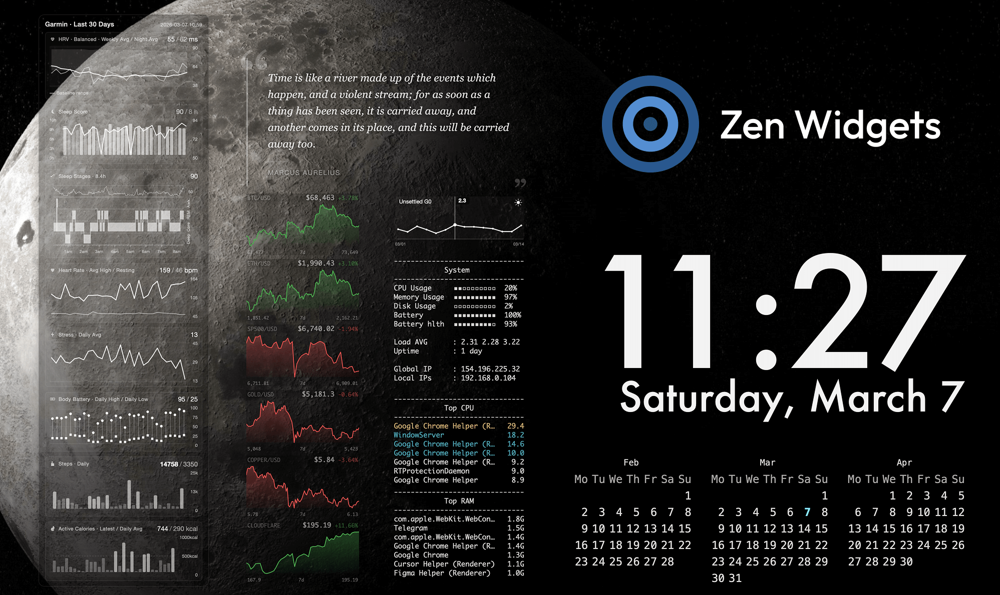

# Übersicht Widgets

A collection of desktop widgets for [Übersicht](https://tracesof.net/uebersicht/) on macOS.




## System Requirements

- **macOS** with [Übersicht](https://tracesof.net/uebersicht/) installed
- **python3** — used by GarminConnect, PriceCharts, Quotes, and SolarActivity widgets
- **curl** — used by PriceCharts for fetching asset prices
- Standard macOS CLI tools (`top`, `awk`, `sed`, `bc`, `sysctl`, `df`, `pmset`, `dig`, `ifconfig`, etc.) — these ship with macOS

## Configuration

Some widgets use a `config.env` file for local settings. Each widget that requires configuration ships a `config.env.example` — copy it to `config.env` and edit as needed:

```bash
cp config.env.example config.env
```

`config.env` files are git-ignored so local settings stay out of version control.

## Widgets

| Widget | Description | Dependencies | Config |
|--------|-------------|--------------|--------|
| [ClockCalendar](ClockCalendar.widget/) | Clock, date, and 3-month calendar grid | None | None |
| [GarminConnect](GarminConnect.widget/) | Garmin health metrics — HRV, sleep, heart rate, stress, body battery, steps, calories (30 days) | python3, garminconnect (pip) | config.env, .venv, OAuth tokens |
| [GeekToolStyle](GeekToolStyle.widget/) | System info — CPU, memory, disk, battery, network, top processes | Standard macOS CLI tools | None |
| [LifeCounter](LifeCounter.widget/) | Memento Mori life-in-weeks grid | None | config.env |
| [PriceCharts](PriceCharts.widget/) | Asset price sparkline charts (crypto, stocks, commodities) | python3, curl | config.env |
| [Quotes](Quotes.widget/) | Random quote display | python3 | None |
| [SolarActivity](SolarActivity.widget/) | Solar Kp index timeline with 7-day forecast | python3 | None |

See each widget's own README for setup details.
